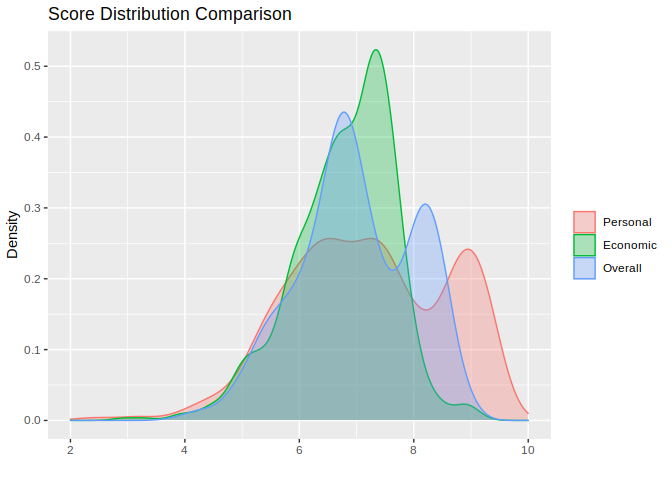
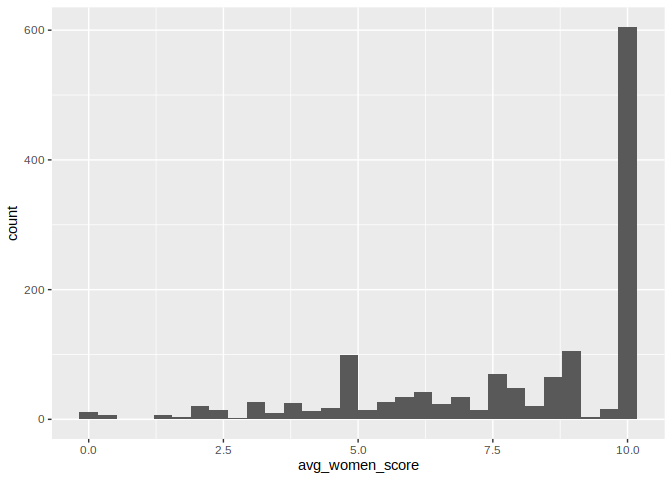

Human Freedom Index and Suicides Project
================
Doug Cady
November 9, 2021

R version 4.1.1 “Kick Things”

``` r
library(readr)
library(dplyr)
library(tidyr)
library(stringr)
library(ggplot2)
library(GGally)
```

## Load dataset into R

``` r
hfi <- read_csv("../data/hfi_cc_2018.csv")
```

## Explore HFI dataset

### Questions to answer:

  - Are the freedom score, number of suicides per 100k, and gdp per
    capita related?
      - Find correlations, make 3 scatter pair plots
  - Does population size impact freedom?
  - Does female freedom scores relate to female suicide rates?
  - What are important factors that contribute to human freedom?
      - Linear regression model

### Hypotheses:

1.  Countries with high female freedom scores will have less than
    average female suicide rates
    
    Ho: mean suicide rates lo female freedom \>= average female suicide
    rate
    
    Ha: mean suicide rates hi female freedom \< average female suicide
    rate
    
      - `pf_ss_women_fgm` - Female genital mutilation
      - `pf_ss_women_inheritance` - Equal inheritance rights for widows
        and daughters
      - `pf_movement_women` - Freedom of movement for women
      - `pf_identity_sex_female` - Female to female relationships
      - `pf_identity_divorce` - Divorce
      - Perhaps educational opportunity or abortion access should be
        included here as well?

2.  Countries with smaller populations will have more freedom
    
    Ho: mean freedom small population \<= mean freedom large population
    
    Ha: mean freedom small population \> mean freedom large population
    
      - `hf_score` - Overall Human Freedom Index score
      - `population` - (suicides dataset) country population

### Column Descriptions

There are many, many columns in this dataset, so let us focus on a few
columns

  - 1 time-series variable
      - `year`
  - 3 categorical variables
      - `country`
      - `ISO_code` (country abbreviation)
      - `region`
  - 119 numeric (narrowed down to only a handful)
      - Freedom indicators and their aggregate category scores, like
          - Female genital mutilation and inheritance rights (widows,
            daughters) make up 3 columns and are aggregated into one
            category score - Female security and safety

<!-- end list -->

``` r
categ_cols <- c(
    "year",
    "country",
    "region"
)

focus_cols <- c(
    "pf_ss_women_fgm",
    "pf_ss_women_inheritance",
    "pf_movement_women",
    "pf_identity_sex_female",
    "pf_identity_divorce",
    "pf_score",
    "ef_score",
    "hf_score"
)


# Look at focus subset of columns and update categoricals to factor type
hfi_focus <- rename(hfi, country = countries) %>%
    mutate(country = factor(country),
           region = factor(region))
hfi_focus <- hfi_focus[, str_c(c(categ_cols, focus_cols))]
write_csv(hfi_focus, "../data/clean_hfi_2018.csv")

print(str(hfi_focus))
```

    ## tibble [1,458 × 11] (S3: tbl_df/tbl/data.frame)
    ##  $ year                   : num [1:1458] 2016 2016 2016 2016 2016 ...
    ##  $ country                : Factor w/ 162 levels "Albania","Algeria",..: 1 2 3 4 5 6 7 8 9 10 ...
    ##  $ region                 : Factor w/ 10 levels "Caucasus & Central Asia",..: 3 5 9 4 1 7 10 1 4 5 ...
    ##  $ pf_ss_women_fgm        : num [1:1458] 10 10 10 10 10 10 10 10 NA 10 ...
    ##  $ pf_ss_women_inheritance: num [1:1458] 5 0 5 10 10 10 10 7.5 NA 0 ...
    ##  $ pf_movement_women      : num [1:1458] 5 5 10 10 10 10 10 5 NA 5 ...
    ##  $ pf_identity_sex_female : num [1:1458] 10 0 0 10 10 10 10 10 10 10 ...
    ##  $ pf_identity_divorce    : num [1:1458] 5 0 10 10 5 10 10 5 NA 0 ...
    ##  $ pf_score               : num [1:1458] 7.6 5.28 6.11 8.1 6.91 ...
    ##  $ ef_score               : num [1:1458] 7.54 4.99 5.17 4.84 7.57 7.98 7.58 6.49 7.34 7.56 ...
    ##  $ hf_score               : num [1:1458] 7.57 5.14 5.64 6.47 7.24 ...
    ## NULL

### Head / Tail of Data

Nothing out of the ordinary here. It seems like we read in the whole
file and do not need to skip any header or footer miscellaneous data.

``` r
print(head(hfi_focus))
```

    ## # A tibble: 6 x 11
    ##    year country  region       pf_ss_women_fgm pf_ss_women_inhe… pf_movement_wom…
    ##   <dbl> <fct>    <fct>                  <dbl>             <dbl>            <dbl>
    ## 1  2016 Albania  Eastern Eur…              10                 5                5
    ## 2  2016 Algeria  Middle East…              10                 0                5
    ## 3  2016 Angola   Sub-Saharan…              10                 5               10
    ## 4  2016 Argenti… Latin Ameri…              10                10               10
    ## 5  2016 Armenia  Caucasus & …              10                10               10
    ## 6  2016 Austral… Oceania                   10                10               10
    ## # … with 5 more variables: pf_identity_sex_female <dbl>,
    ## #   pf_identity_divorce <dbl>, pf_score <dbl>, ef_score <dbl>, hf_score <dbl>

``` r
print(tail(hfi_focus))
```

    ## # A tibble: 6 x 11
    ##    year country  region       pf_ss_women_fgm pf_ss_women_inhe… pf_movement_wom…
    ##   <dbl> <fct>    <fct>                  <dbl>             <dbl>            <dbl>
    ## 1  2008 Uruguay  Latin Ameri…            10                  10               10
    ## 2  2008 Venezue… Latin Ameri…            10                  10               10
    ## 3  2008 Vietnam  South Asia              10                  10               10
    ## 4  2008 Yemen, … Middle East…            NA                  NA               NA
    ## 5  2008 Zambia   Sub-Saharan…            10                   0               10
    ## 6  2008 Zimbabwe Sub-Saharan…             9.5                 5                5
    ## # … with 5 more variables: pf_identity_sex_female <dbl>,
    ## #   pf_identity_divorce <dbl>, pf_score <dbl>, ef_score <dbl>, hf_score <dbl>

### Distribution of Scores - Personal, Economic, Overall Human Freedom

``` r
score_cols <- c("pf_score", "ef_score", "hf_score")
scores <- hfi_focus %>%
    pivot_longer(cols = score_cols, names_to = "freedom", values_to = "score")
scores <- scores[, str_c(c(categ_cols, "freedom", "score"))]

scores$freedom <- recode_factor(scores$freedom, "pf_score" = "Personal",
                                                "ef_score" = "Economic",
                                                "hf_score" = "Overall")

# Freedom distribution
ggplot(scores) +
    geom_density(aes(x = score, color = freedom, fill = freedom), alpha = 0.3) +
    labs(x = '', y = 'Density', title = 'Score Distribution Comparison', color = '', fill = '') +
    scale_x_continuous(limits = c(2, 10))
```

<!-- -->

##### Personal freedom scores are more spread out than economic or overall freedom scores. Very few countries have scores below 4. The majority of economic scores fall between 6 and 8, lower than many countries’ personal freedom scores.

### Women Freedom

``` r
women_freedom_cols <- c(
    "pf_ss_women_fgm",
    "pf_ss_women_inheritance",
    "pf_movement_women",
    "pf_identity_sex_female",
    "pf_identity_divorce")

women_freedom_init <- hfi_focus[, str_c(c(categ_cols, women_freedom_cols))]
summary(women_freedom_init)
```

    ##       year           country                               region   
    ##  Min.   :2008   Albania  :   9   Sub-Saharan Africa           :378  
    ##  1st Qu.:2010   Algeria  :   9   Latin America & the Caribbean:234  
    ##  Median :2012   Angola   :   9   Eastern Europe               :198  
    ##  Mean   :2012   Argentina:   9   Middle East & North Africa   :171  
    ##  3rd Qu.:2014   Armenia  :   9   Western Europe               :162  
    ##  Max.   :2016   Australia:   9   South Asia                   :153  
    ##                 (Other)  :1404   (Other)                      :162  
    ##  pf_ss_women_fgm pf_ss_women_inheritance pf_movement_women
    ##  Min.   : 0.40   Min.   : 0.00           Min.   : 0.00    
    ##  1st Qu.: 9.60   1st Qu.: 5.00           1st Qu.: 5.00    
    ##  Median :10.00   Median : 5.00           Median :10.00    
    ##  Mean   : 9.24   Mean   : 6.64           Mean   : 8.04    
    ##  3rd Qu.:10.00   3rd Qu.:10.00           3rd Qu.:10.00    
    ##  Max.   :10.00   Max.   :10.00           Max.   :10.00    
    ##  NA's   :172     NA's   :119             NA's   :141      
    ##  pf_identity_sex_female pf_identity_divorce
    ##  Min.   : 0.00          Min.   : 0.0       
    ##  1st Qu.:10.00          1st Qu.: 5.0       
    ##  Median :10.00          Median :10.0       
    ##  Mean   : 7.94          Mean   : 7.5       
    ##  3rd Qu.:10.00          3rd Qu.:10.0       
    ##  Max.   :10.00          Max.   :10.0       
    ##  NA's   :80             NA's   :873

#### Missing values

The 5 women freedom variables have at least 5% missing values with
Divorce having almost 60%:

  - `pf_ss_women_fgm` - Female genital mutilation - 11.8% missing
  - `pf_ss_women_inheritance` - Female inheritance - 8.2%
  - `pf_movement_women` - Women movement - 9.7%
  - `pf_identity_sex_female` - Female to female relationships - 5.5%
  - `pf_identity_divorce` - Divorce - 59.9%

<!-- end list -->

``` r
sapply(women_freedom_init,
       function(x) paste0(round(sum(is.na(x)) / nrow(women_freedom_init) * 100, 1), "%"))
```

    ##                    year                 country                  region 
    ##                    "0%"                    "0%"                    "0%" 
    ##         pf_ss_women_fgm pf_ss_women_inheritance       pf_movement_women 
    ##                 "11.8%"                  "8.2%"                  "9.7%" 
    ##  pf_identity_sex_female     pf_identity_divorce 
    ##                  "5.5%"                 "59.9%"

``` r
# What to do about Divorce missing values? Impute? Interpolate? Remove?
# Instead, we can average the 5 women freedom columns together and then remove the columns
# with NAs - equal to the minimum NA% from the individual columns (5.5%)
women_freedom_init$avg_women_score <- rowMeans(select(women_freedom_init, women_freedom_cols),
                                               na.rm = TRUE)

women_freedom <- women_freedom_init[!is.na(women_freedom_init$avg_women_score),
                                    c("year", "country", "region", "avg_women_score")]

ggplot(women_freedom) + geom_histogram(aes(x = avg_women_score))
```

<!-- -->
