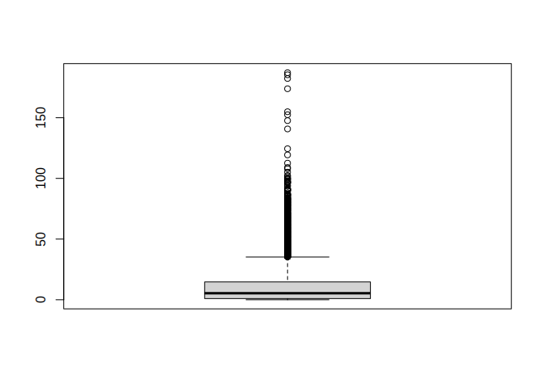
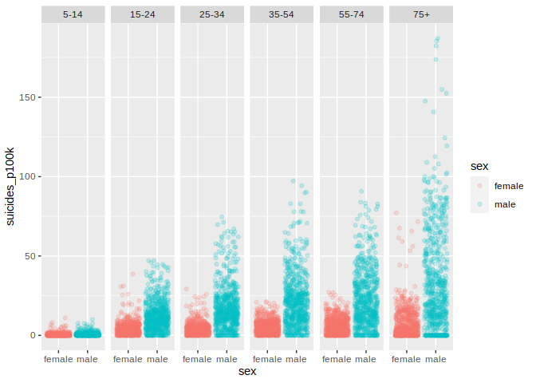
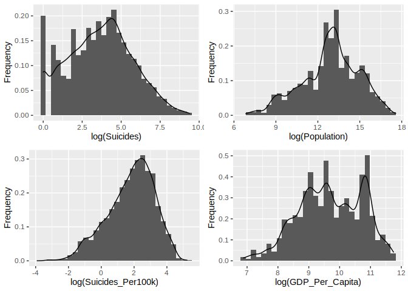

Human Freedom Index and Suicides Project
================
Doug Cady
November 6, 2021

R version 4.1.1 “Kick Things”

``` r
library(readr)
library(dplyr)
library(tidyr)
library(stringr)
library(ggplot2)
library(GGally)
library(gridExtra)
library(plotly)
```

## Load dataset into R

``` r
suicides <- read_csv("../data/suicide_rates.csv")
```

## Explore Suicides dataset

#### This is the initial dataset format when R loads it into its program, but we need to change the type of several of these to a factor (categorical) format.

``` r
print(summary(suicides))
```

    ##    country               year          sex                age           
    ##  Length:27820       Min.   :1985   Length:27820       Length:27820      
    ##  Class :character   1st Qu.:1995   Class :character   Class :character  
    ##  Mode  :character   Median :2002   Mode  :character   Mode  :character  
    ##                     Mean   :2001                                        
    ##                     3rd Qu.:2008                                        
    ##                     Max.   :2016                                        
    ##                                                                         
    ##   suicides_no      population       suicides/100k pop country-year      
    ##  Min.   :    0   Min.   :     278   Min.   :  0.00    Length:27820      
    ##  1st Qu.:    3   1st Qu.:   97498   1st Qu.:  0.92    Class :character  
    ##  Median :   25   Median :  430150   Median :  5.99    Mode  :character  
    ##  Mean   :  243   Mean   : 1844794   Mean   : 12.82                      
    ##  3rd Qu.:  131   3rd Qu.: 1486143   3rd Qu.: 16.62                      
    ##  Max.   :22338   Max.   :43805214   Max.   :224.97                      
    ##                                                                         
    ##   HDI for year   gdp_for_year ($)   gdp_per_capita ($)  generation       
    ##  Min.   :0       Min.   :4.69e+07   Min.   :   251     Length:27820      
    ##  1st Qu.:1       1st Qu.:8.99e+09   1st Qu.:  3447     Class :character  
    ##  Median :1       Median :4.81e+10   Median :  9372     Mode  :character  
    ##  Mean   :1       Mean   :4.46e+11   Mean   : 16866                       
    ##  3rd Qu.:1       3rd Qu.:2.60e+11   3rd Qu.: 24874                       
    ##  Max.   :1       Max.   :1.81e+13   Max.   :126352                       
    ##  NA's   :19456

### Update format with factor and numeric variables, year \>= 2008 to match HFI data

  - 3 categorical variables
      - `country`
      - `sex`
      - `age`
  - 4 numeric
      - `suicides`
      - `population`
      - `suicides per`100k\`
      - `gdp per capita`
  - 1 time-series
      - `year`

<!-- end list -->

``` r
age_levels <- c("5-14", "15-24", "25-34", "35-54", "55-74", "75+")

suic_fmt <- suicides %>%
    mutate(country = factor(country),
           year = year,
           sex = factor(sex),
           age = factor(str_replace(age, " years", ""), levels = age_levels),
           suicides_p100k = `suicides/100k pop`,
           gdp_per_capita = `gdp_per_capita ($)`) %>%
    select(country, year, sex, age, suicides_no, population, suicides_p100k, gdp_per_capita) %>%
    filter(year >= 2008)

write_csv(suic_fmt, "../data/clean_suicides.csv")

print(summary(suic_fmt))
```

    ##            country          year          sex          age      
    ##  Armenia       : 106   Min.   :2008   female:3974   5-14 :1298  
    ##  Austria       : 106   1st Qu.:2009   male  :3974   15-24:1330  
    ##  Croatia       : 106   Median :2011                 25-34:1330  
    ##  Cyprus        : 106   Mean   :2011                 35-54:1330  
    ##  Czech Republic: 106   3rd Qu.:2013                 55-74:1330  
    ##  Grenada       : 106   Max.   :2016                 75+  :1330  
    ##  (Other)       :7312                                            
    ##   suicides_no      population       suicides_p100k   gdp_per_capita  
    ##  Min.   :    0   Min.   :     939   Min.   :  0.00   Min.   :   977  
    ##  1st Qu.:    3   1st Qu.:  104994   1st Qu.:  0.97   1st Qu.:  7806  
    ##  Median :   25   Median :  473673   Median :  5.36   Median : 15552  
    ##  Mean   :  233   Mean   : 1943797   Mean   : 11.32   Mean   : 25852  
    ##  3rd Qu.:  121   3rd Qu.: 1567271   3rd Qu.: 14.69   3rd Qu.: 41798  
    ##  Max.   :11848   Max.   :43002471   Max.   :187.06   Max.   :126352  
    ## 

#### Data Summary

  - No NAs, thus no missing values
  - Each of the 4 numeric variables have a heavy right skew (mean \>\>
    median):
      - We can see this more clearly visually with histograms (see next
        page)
      - Log transformations are required to see variable distributions

### Head / Tail of Data

Nothing out of the ordinary here. It seems like we read in the whole
file and do not need to skip any header or footer miscellaneous data.

``` r
print(head(suic_fmt))
```

    ## # A tibble: 6 x 8
    ##   country  year sex   age   suicides_no population suicides_p100k gdp_per_capita
    ##   <fct>   <dbl> <fct> <fct>       <dbl>      <dbl>          <dbl>          <dbl>
    ## 1 Albania  2008 male  25-34          21     172855          12.2            4672
    ## 2 Albania  2008 male  35-54          37     377119           9.81           4672
    ## 3 Albania  2008 male  55-74          21     228672           9.18           4672
    ## 4 Albania  2008 fema… 75+             5      59369           8.42           4672
    ## 5 Albania  2008 fema… 15-24          20     276073           7.24           4672
    ## 6 Albania  2008 fema… 25-34           9     182663           4.93           4672

``` r
print(tail(suic_fmt))
```

    ## # A tibble: 6 x 8
    ##   country  year sex   age   suicides_no population suicides_p100k gdp_per_capita
    ##   <fct>   <dbl> <fct> <fct>       <dbl>      <dbl>          <dbl>          <dbl>
    ## 1 Uzbeki…  2014 fema… 25-34         162    2735238           5.92           2309
    ## 2 Uzbeki…  2014 fema… 35-54         107    3620833           2.96           2309
    ## 3 Uzbeki…  2014 fema… 75+             9     348465           2.58           2309
    ## 4 Uzbeki…  2014 male  5-14           60    2762158           2.17           2309
    ## 5 Uzbeki…  2014 fema… 5-14           44    2631600           1.67           2309
    ## 6 Uzbeki…  2014 fema… 55-74          21    1438935           1.46           2309

### Further investigate high suicide counts

Sorting by suicide counts descending tells us that US and Russian men
age 35-54 had the highest suicide raw counts from 2008 - 2015, but this
is not scaled by population yet. If we instead look at suicides per 100k
persons, will the same trend hold?

``` r
high_suicides <- suic_fmt %>%
    filter(suicides_no > 1000) %>%
    arrange(desc(suicides_no)) %>%
    print()
```

    ## # A tibble: 418 x 8
    ##    country             year sex   age   suicides_no population suicides_p100k
    ##    <fct>              <dbl> <fct> <fct>       <dbl>      <dbl>          <dbl>
    ##  1 Russian Federation  2008 male  35-54       11848   20041975           59.1
    ##  2 United States       2010 male  35-54       11767   42798501           27.5
    ##  3 United States       2012 male  35-54       11763   42326226           27.8
    ##  4 Russian Federation  2009 male  35-54       11721   19901557           58.9
    ##  5 United States       2011 male  35-54       11681   42566273           27.4
    ##  6 United States       2015 male  35-54       11634   41658010           27.9
    ##  7 United States       2009 male  35-54       11613   42932194           27.0
    ##  8 United States       2014 male  35-54       11455   41858354           27.4
    ##  9 United States       2013 male  35-54       11396   42085688           27.1
    ## 10 United States       2008 male  35-54       11371   43002471           26.4
    ## # … with 408 more rows, and 1 more variable: gdp_per_capita <dbl>

#### Suicides per 100k persons

US and Russian men are no longer at the top of list, so it may have been
due to their large population that so many suicides occurred. In both of
these lists I see only male persons that are older as well, so maybe sex
or age plays a factor here.

``` r
suic_fmt %>%
    arrange(desc(suicides_p100k)) %>%
    print()
```

    ## # A tibble: 7,948 x 8
    ##    country            year sex   age   suicides_no population suicides_p100k
    ##    <fct>             <dbl> <fct> <fct>       <dbl>      <dbl>          <dbl>
    ##  1 Suriname           2012 male  75+            10       5346           187.
    ##  2 Republic of Korea  2011 male  75+          1276     688365           185.
    ##  3 Republic of Korea  2010 male  75+          1152     631853           182.
    ##  4 Republic of Korea  2009 male  75+          1006     578635           174.
    ##  5 Republic of Korea  2008 male  75+           828     534462           155.
    ##  6 Republic of Korea  2012 male  75+          1137     745816           152.
    ##  7 Republic of Korea  2013 male  75+          1191     806960           148.
    ##  8 Republic of Korea  2015 male  75+          1329     944284           141.
    ##  9 Republic of Korea  2014 male  75+          1090     875829           124.
    ## 10 Montenegro         2009 male  75+            15      12568           119.
    ## # … with 7,938 more rows, and 1 more variable: gdp_per_capita <dbl>

``` r
# We can also look at the quantile breakdown for suicides per 100k persons:
quantile(suic_fmt$suicides_p100k, probs = seq(0, 1, 1/10))
```

    ##     0%    10%    20%    30%    40%    50%    60%    70%    80%    90%   100% 
    ##   0.00   0.00   0.48   1.56   3.18   5.36   8.23  12.19  18.12  29.94 187.06

``` r
# A boxplot can show us visually that the rates are pretty low except for some high outliers
boxplot(suic_fmt$suicides_p100k)
```

<!-- -->

``` r
# What about all those 0 values? Do some countries have only 0 values for every record?
suic_cts_country <- suic_fmt %>%
    mutate(zero_suicides = if_else(suicides_no == 0, 1, 0)) %>%
    group_by(country, zero_suicides) %>%
    count() %>%
    pivot_wider(names_from = "zero_suicides", values_from = "n", names_prefix = "zero_suic_") %>%
    rename(rec_ct_suic_gt0 = zero_suic_0,
           rec_ct_suic_eq0 = zero_suic_1) %>%
    mutate(perc_zero_suic_recs = rec_ct_suic_eq0 / (rec_ct_suic_eq0 + rec_ct_suic_gt0)) %>%
    arrange(desc(perc_zero_suic_recs))

print(suic_cts_country)
```

    ## # A tibble: 94 x 4
    ## # Groups:   country [94]
    ##    country                    rec_ct_suic_gt0 rec_ct_suic_eq0 perc_zero_suic_re…
    ##    <fct>                                <int>           <int>              <dbl>
    ##  1 Antigua and Barbuda                      1              71              0.986
    ##  2 Grenada                                  3             103              0.972
    ##  3 Barbados                                 5              67              0.931
    ##  4 Maldives                                 3              33              0.917
    ##  5 Saint Vincent and Grenadi…              20              76              0.792
    ##  6 Seychelles                              25              71              0.740
    ##  7 Oman                                    11              25              0.694
    ##  8 Aruba                                   15              33              0.688
    ##  9 Bahamas                                 25              47              0.653
    ## 10 Saint Lucia                             30              54              0.643
    ## # … with 84 more rows

``` r
write_csv(suic_cts_country, "../output/suicide_counts_country.csv")
```

#### Suicides per 100k persons vs Age by Sex

Does sex or age contribute to historic suicide rates? Yes, it does seem
like suicides are more common among men than women and elderly vs young
folks, though this plot contains 30 years of data for over 100
countries.

``` r
ggplot(suic_fmt) +
    geom_jitter(aes(x = sex, y = suicides_p100k, color = sex),
                alpha = 0.2) +
    facet_grid( ~ age)
```

<!-- -->

### Variable Distributions

I first tried a regular histogram for the variable `suicide_no`, but
there is such a pronounced right skew that applying a log to the x axis
made sense. I believe `population`, `suicides per 100k`, and `gdp per
capita` might have a similar problem in viewing their distributions with
no transformations applied.

I created a log histogram and density plot function to help in making
these 4 plots. The `get()` function can give ggplot the correct column
name from an input “string” column name. If I was using Python, I would
have created a dictionary and looped over it to get the column and axis
labels, but R makes this process harder.

``` r
make_hist <- function(xlab, col) {
    ggplot(suic_fmt) +
        geom_histogram(aes(x = log(get(col)), y = ..density..)) +
        geom_density(aes(x = log(get(col)))) +
        labs(x = xlab, y = "Frequency")
}

h1 <- make_hist(xlab = "log(Suicides)", col = "suicides_no")
h2 <- make_hist(xlab = "log(Population)", col = "population")
h3 <- make_hist(xlab = "log(Suicides_Per100k)", col = "suicides_p100k")
h4 <- make_hist(xlab = "log(GDP_Per_Capita)", col = "gdp_per_capita")

grid.arrange(h1, h2, h3, h4, ncol = 2)
```

<!-- -->

### Time-series trends

Lastly, I would like to take a look at the `year` variable to see if
there is any time-series trends at play.

``` r
suic_totals <- suic_fmt %>%
    select(year, country, suicides_no, population) %>%
    group_by(year, country) %>%
    summarize(total_suicides = sum(suicides_no),
              total_pop = sum(population),
              total_suicides_p100k = total_suicides / total_pop * 100000)

# We are missing data from some years for some countries
# Show table of year, country, suicide rates
# pivot_longer(suic_totals, year,

ggp_time <- ggplotly(ggplot(suic_totals) +
    geom_line(aes(x = year, y = total_suicides_p100k, color = country, group = country),
              alpha = 0.3, show.legend = FALSE))
```

<iframe src="/home/doug/Documents/GMU_Grad/7_AIT_664/project/bin/index.html" width="100%" height="600" scrolling="no" seamless="seamless" frameBorder="0"></iframe>
