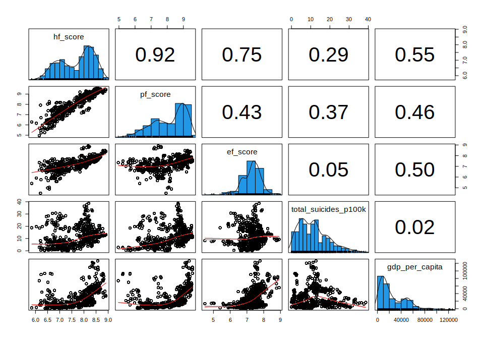
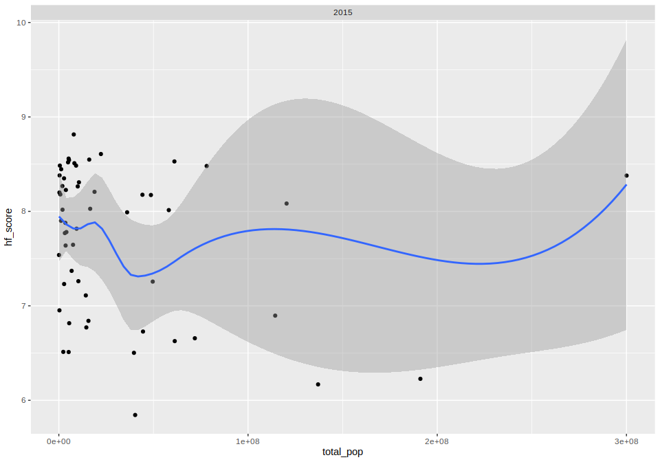
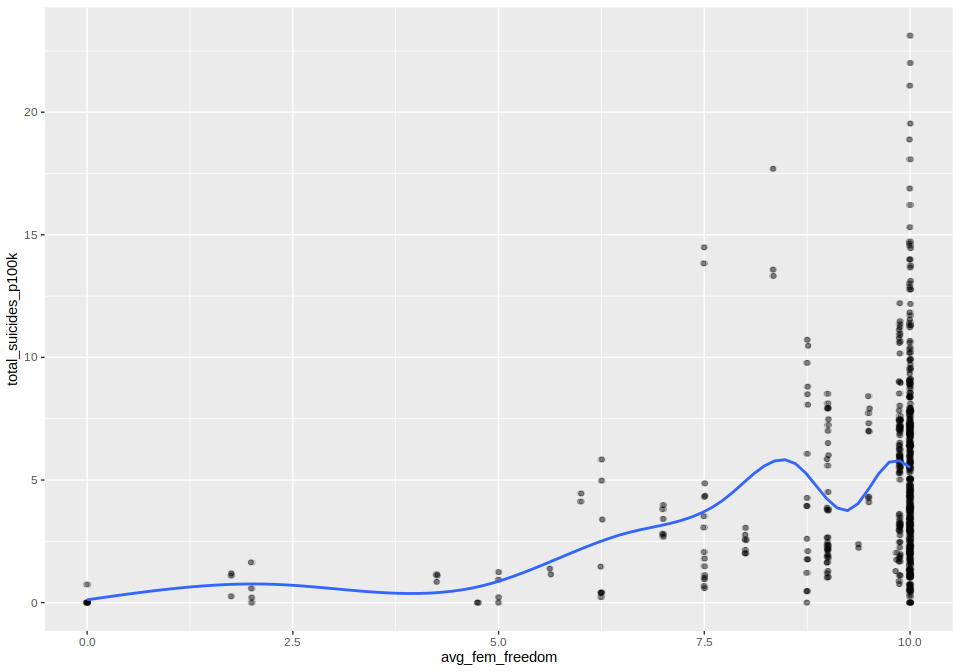

Human Freedom Index and Suicides Project
================
Doug Cady
November 13, 2021

R version 4.1.1 “Kick Things”

``` r
library(readr)
library(dplyr)
library(tidyr)
library(ggplot2)
library(psych)
# library(stringr)
# library(GGally)
# library(plotly)
```

## Load datasets into R

``` r
hfi <- read_csv("../data/clean_hfi_2018.csv")
suicides <- read_csv("../data/clean_suicides.csv")
```

## Join datasets on `year` and `country` variables

``` r
# How many countries in each dataset?
hfi_countries <- unique(hfi$country)
print(length(hfi_countries))  # 162
```

    ## [1] 162

``` r
suic_countries <- unique(suicides$country)
print(length(suic_countries))  # 101
```

    ## [1] 94

``` r
init_joined <- inner_join(hfi, suicides, by = c("year", "country"))
init_join_countries <- unique(init_joined$country)
print(length(init_join_countries))  # 78
```

    ## [1] 78

``` r
# 23 countries weren't joined together initially, why?
nonjoin_countries <- setdiff(suic_countries, init_join_countries)
print(nonjoin_countries)
```

    ##  [1] "Antigua and Barbuda"          "Aruba"                       
    ##  [3] "Cabo Verde"                   "Cuba"                        
    ##  [5] "Czech Republic"               "Grenada"                     
    ##  [7] "Kyrgyzstan"                   "Maldives"                    
    ##  [9] "Puerto Rico"                  "Republic of Korea"           
    ## [11] "Russian Federation"           "Saint Lucia"                 
    ## [13] "Saint Vincent and Grenadines" "Slovakia"                    
    ## [15] "Turkmenistan"                 "Uzbekistan"

``` r
# print(setdiff(hfi_countries, init_join_countries))
```

### Investigate country names that don’t match

Use duckduckgo and wikipedia to sort out name mismatches (if possible)

``` r
# Antigua and Barbuda - only in suicides (ok)
# Aruba - only in suicides (ok)
# Azerbaijan - country in both, but years don't align (ok)
# Cabo Verde - in hfi named Cape Verde, change to Cape Verde in suicides data (!fix suicides)
# Cuba - only in suicides data (ok)
# Czech Republic - hfi abbreviated to Czech Rep. (!fix hfi)
# Dominica - only in suicides, different from Dominican Republic (in hfi) (ok)
# Grenada - only in suicides (ok)
# Kiribati - only in suicides (ok)
# Kyrgyzstan - hfi lists official name "Kyrgyz Republic" (!fix hfi)
# Macau - only in suicides (ok)
# Maldives - only in suicides (ok)
# Puerto Rico - only in suicides (ok)
# Republic of Korea - hfi lists as "Korea, South" (!fix hfi)
# Russian Federation - hfi lists as "Russia" (!fix suicides)
# Saint Kitts and Nevis - only in suicides (ok)
# Saint Lucia - only in suicides (ok)
# Saint Vincent and Grenadines - only in suicides (ok)
# San Marino - only in suicides (ok)
# Slovakia - hfi lists as "Slovak Rep." (!fix hfi)
# Sri Lanka - country in both, but years don't align (ok)
# Turkmenistan - only in suicides (ok)
# Uzbekistan - only in suicides (ok)

## Check existence of country and years available in each dataset:
# HFI
print(unique(filter(hfi, str_detect(country, "India"))$country))
```

    ## [1] "India"

``` r
print(unique(filter(hfi, str_detect(country, "India"))$year))
```

    ## [1] 2016 2015 2014 2013 2012 2011 2010 2009 2008

``` r
# Suicides
print(unique(filter(suicides, str_detect(country, "India"))$country))
```

    ## character(0)

``` r
print(unique(filter(suicides, str_detect(country, "India"))$year))
```

    ## numeric(0)

### Clean up country names that didn’t match initially

``` r
hfi_clean_cntry <- hfi %>%
    mutate(country = str_replace(country, "Czech Rep.", "Czech Republic"),
           country = str_replace(country, "Kyrgyz Republic", "Kyrgyzstan"),
           country = str_replace(country, "Korea, South", "Republic of Korea"),
           country = str_replace(country, "Slovak Rep.", "Slovakia"),)


suic_clean_cntry <- suicides %>%
    mutate(country = str_replace(country, "Cabo Verde", "Cape Verde"),
           country = str_replace(country, "Russian Federation", "Russia"))

joined <- inner_join(hfi_clean_cntry, suic_clean_cntry, by = c("year", "country"))

print(length(unique(joined$country))) # 78 init, 84 final
```

    ## [1] 84

``` r
# 2016 doesn't seem to have many records, maybe it should be excluded from this analysis?
# Yes, it has far fewer (< 20%) records than other years have
joined %>%
    group_by(year) %>%
    count()
```

    ## # A tibble: 9 x 2
    ## # Groups:   year [9]
    ##    year     n
    ##   <dbl> <int>
    ## 1  2008   912
    ## 2  2009   960
    ## 3  2010   948
    ## 4  2011   924
    ## 5  2012   876
    ## 6  2013   864
    ## 7  2014   840
    ## 8  2015   672
    ## 9  2016   150

``` r
joined_no2016 <- filter(joined, year != 2016)
print(paste(nrow(joined_no2016), ncol(joined_no2016)))
```

    ## [1] "6996 17"

``` r
write_csv(joined_no2016, "../output/clean_hfi_suicides_joined_no2016.csv")
```

## Explore correlations between freedom, suicides, and GDP

Overall, personal, and economic freedom scores, number of suicides per
100k, and GDP per
capita

``` r
# Suicides are currently broken down by age and sex, we need to aggregate to total counts
corr_data <- joined_no2016 %>%
    group_by(year, country) %>%
    mutate(total_suicides = sum(suicides_no),
           total_pop = sum(population),
           total_suicides_p100k = total_suicides / total_pop * 100000) %>%
    ungroup() %>%
    select(hf_score, pf_score, ef_score, total_suicides_p100k, gdp_per_capita)

summary(corr_data)
```

    ##     hf_score       pf_score       ef_score    total_suicides_p100k
    ##  Min.   :5.84   Min.   :4.96   Min.   :4.49   Min.   : 0.00       
    ##  1st Qu.:7.08   1st Qu.:7.35   1st Qu.:6.91   1st Qu.: 5.43       
    ##  Median :7.90   Median :8.48   Median :7.34   Median :10.79       
    ##  Mean   :7.70   Mean   :8.13   Mean   :7.27   Mean   :11.63       
    ##  3rd Qu.:8.26   3rd Qu.:9.00   3rd Qu.:7.65   3rd Qu.:16.46       
    ##  Max.   :8.91   Max.   :9.57   Max.   :8.92   Max.   :38.66       
    ##  NA's   :180    NA's   :180    NA's   :180                        
    ##  gdp_per_capita  
    ##  Min.   :   977  
    ##  1st Qu.:  8347  
    ##  Median : 17052  
    ##  Mean   : 27493  
    ##  3rd Qu.: 44747  
    ##  Max.   :126352  
    ## 

``` r
# Correlation pairs plot with histograms, density, and scatter plots
pairs.panels(corr_data,
             smooth = TRUE,
             scale = FALSE,
             density = TRUE,
             ellipses = FALSE,
             method = "pearson",
             pch = 21,
             lm = FALSE,
             cor = TRUE,
             jiggle = FALSE,
             hist.col = 4,
             stars = TRUE,
             ci = TRUE)
```

<!-- -->

#### Overall human freedom score seems to be most highly correlated with GDP per capita, though this is not too surprising. Suicide rates do seem to have a weak correlation to personal and human freedom, but not economic freedom or gdp per capita. This makes me wonder if they would be more corelated to a country’s happiness rather than it’s freedom.

## Does a country’s population size impact freedom?

#### No, there doesn’t seem to exist any relationship between population size and human freedom

``` r
ggplot(joined_no2016, aes(x = population, y = hf_score)) +
    geom_point() +
    geom_smooth() +
    facet_wrap( ~ year, nrow = 2)
```

<!-- -->

## Do female freedom scores relate to female suicide rates?

``` r
fem_freedom_suic <- joined_no2016 %>%
    filter(sex == 'female') %>%
    group_by(year, country) %>%
    mutate(total_suicides = sum(suicides_no),
           total_pop = sum(population),
           total_suicides_p100k = total_suicides / total_pop * 100000) %>%
    ungroup() %>%
    select(year, country, pf_ss_women_fgm, pf_ss_women_inheritance, pf_movement_women,
           pf_identity_sex_female, pf_identity_divorce, total_suicides_p100k)

fem_freedom_suic$avg_fem_freedom <- rowMeans(select(fem_freedom_suic,
                                                    pf_ss_women_fgm, pf_ss_women_inheritance,
                                                    pf_movement_women, pf_identity_sex_female,
                                                    pf_identity_divorce), na.rm = TRUE)

ggplot(fem_freedom_suic, aes(x = avg_fem_freedom, y = total_suicides_p100k)) +
    geom_jitter(alpha = 0.1) +
    geom_smooth(se = FALSE)
```

<!-- -->

#### The relationship between female freedom in a country and female suicide rates is non-existent to weak in strength. Many countries have top freedom scores and have a wide range of suicide rates per one hundred thousand persons.

## What are important factors that contribute to human freedom?

``` r
no_countries <- select(joined_no2016, -country, -age, -sex, -region, -pf_ss_women_fgm,
                       -ef_score, -pf_score)
lm1 <- lm(hf_score ~ ., data = no_countries)
summary(lm1)
```

    ## 
    ## Call:
    ## lm(formula = hf_score ~ ., data = no_countries)
    ## 
    ## Residuals:
    ##     Min      1Q  Median      3Q     Max 
    ## -1.8561 -0.1965  0.0884  0.3277  1.3265 
    ## 
    ## Coefficients:
    ##                          Estimate Std. Error t value Pr(>|t|)    
    ## (Intercept)              2.25e-01   2.49e+01    0.01   0.9928    
    ## year                     2.68e-03   1.24e-02    0.22   0.8284    
    ## pf_ss_women_inheritance  3.76e-02   5.30e-03    7.10  1.6e-12 ***
    ## pf_movement_women        1.46e-01   6.22e-03   23.41  < 2e-16 ***
    ## pf_identity_sex_female  -3.58e-02   6.74e-03   -5.32  1.2e-07 ***
    ## pf_identity_divorce      4.31e-02   5.43e-03    7.94  3.2e-15 ***
    ## suicides_no              5.44e-05   1.75e-05    3.10   0.0019 ** 
    ## population              -3.87e-08   3.16e-09  -12.25  < 2e-16 ***
    ## suicides_p100k           1.80e-03   7.15e-04    2.52   0.0119 *  
    ## gdp_per_capita           1.46e-05   3.74e-07   39.07  < 2e-16 ***
    ## ---
    ## Signif. codes:  0 '***' 0.001 '**' 0.01 '*' 0.05 '.' 0.1 ' ' 1
    ## 
    ## Residual standard error: 0.461 on 2174 degrees of freedom
    ##   (4812 observations deleted due to missingness)
    ## Multiple R-squared:  0.618,  Adjusted R-squared:  0.616 
    ## F-statistic:  391 on 9 and 2174 DF,  p-value: <2e-16
